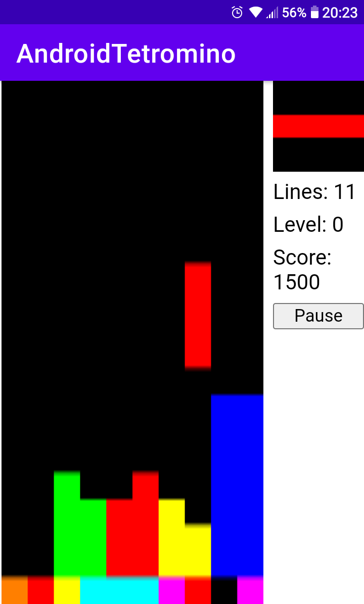

# Tetris-based webapp for Android

App fully made using standard HTML5, JavaScript, and CSS, with minimal bootstrap Java code.

# Building

```
ANDROID_HOME=/path/to/android-sdk ./gradlew assemble
```

# Screenshots

